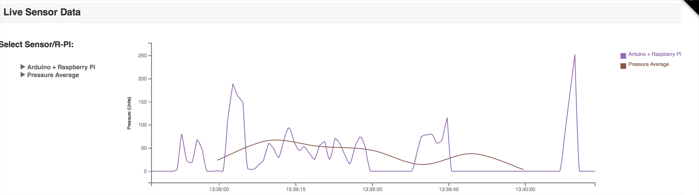
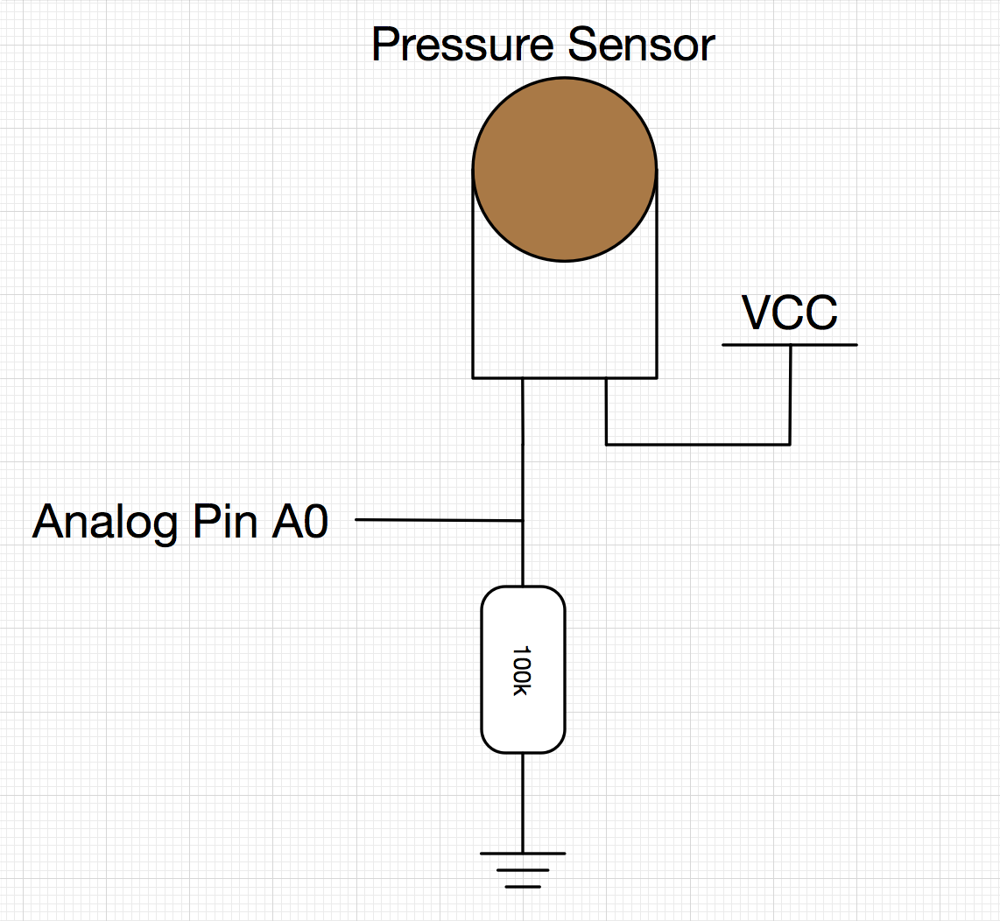
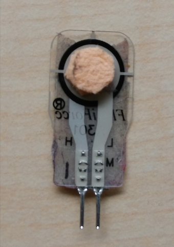
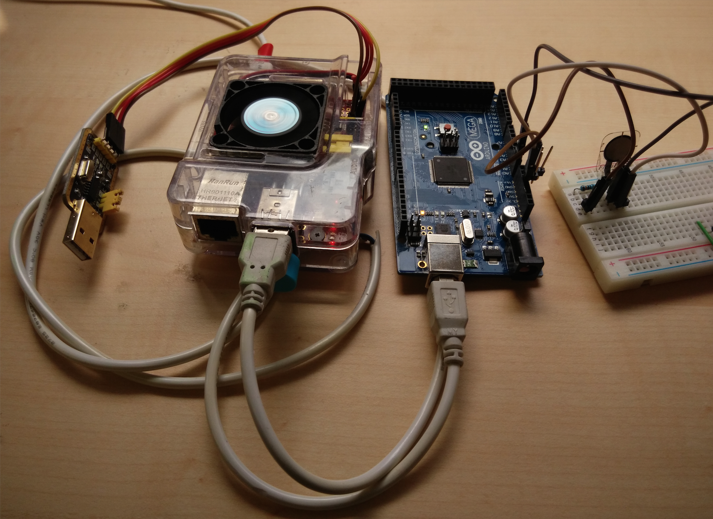

#Application of Sensors and Medical analysis based on Azure
##Information
* Subject: EE514 Real Time Computing
* Topic: Application of Sensors and Medical analysis based on Azure
* Alias: Pressure Sensors Simulation Program
* Version: 1.0

* Fucntion: Read Pressure Sensor's value using analog Pin A0

##Figure

 
 
Figure 1: Monitoring the Pressure Sensor's Value in real time 

##Circuit
 
 
Figure 2: Circuit 

 

 
Figure 3: Pressure Sensor 

 
 
Figure 4: Hardware Connection 

##Contact 
CHEN Yanming - [14096635g@conenect.polyu.hk](mailto:14096635g@conenect.polyu.hk)

TAN Xiao - [14104813g@connect.polyu.hk](mailto:14104813g@conenect.polyu.hk)

Hong Kong Polytechnic University

Department of Electronic Information Engineering
